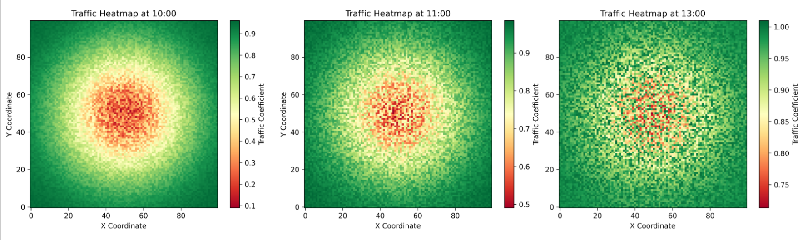
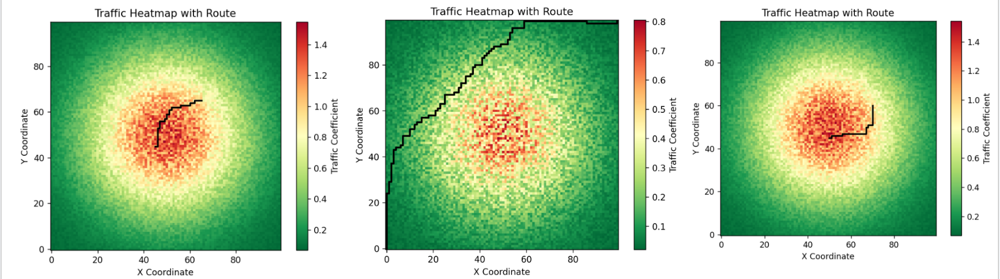
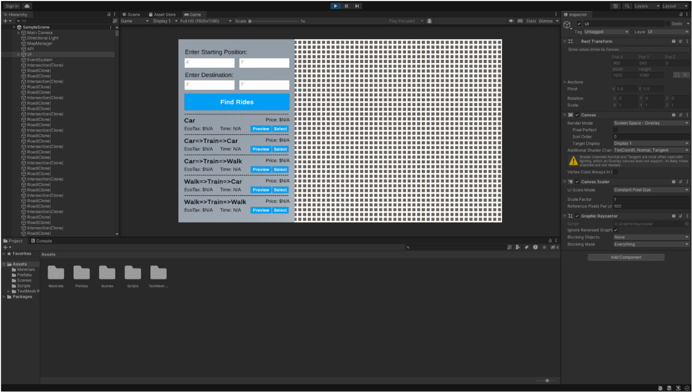

# Aryan

This is our submission of Uber Hackathon 2023.

## Table of Contents
1. [Screenshots](#screenshots)
2. [Tryout API Calls](#Examples)
3. [Explanation](#explanation)
4. [Features & How to Use](#features)
5. [API Reference](#api-reference)
6. [Tech Stack](#tech-stack)
7. [Future Scope](#future-scope)
8. [Authors](#authors)


## Screenshots





## Examples
To view example JSON outputs from the program click this [link](https://github.com/vigneshsaravanakumar404/Uber-Hackathon/blob/main/Presentation%20Data/JSON/data_0_27_to_37_29.json)
To view example heatmap outputs from the program click this [link](https://github.com/vigneshsaravanakumar404/Uber-Hackathon/tree/main/Presentation%20Data)

## Explanation

### Introduction and Goal
Aryan is an innovative application designed to enhance the existing capabilities of Uber. The primary objective of this project is to integrate public transportation options, promote environmental sustainability, improve accessibility, and optimize traffic flow. By doing so, Aryan aims to offer a more comprehensive, efficient, and user-friendly experience.

### Public Transportation: The Problem and The Idea
UberLand, the hypothetical city for this project, boasts an efficient public transportation system. However, the existing Uber application does not fully utilize this resource. Aryan addresses this gap by integrating train routes into the ride options. When a user inputs their starting point and destination, Aryan offers a variety of routes, including those that incorporate train rides or short walks. This feature not only provides quicker and cheaper options but also leverages the city's existing infrastructure for a more efficient experience.

### Traffic Congestion: The Problem and The Idea
Traffic congestion is a significant issue in UberLand, simulated through a 100x100 grid with stochastic models to mimic real-world traffic conditions. Aryan proposes two solutions to mitigate this problem. First, it offers users a list of five travel modes, each optimized for speed or environmental impact. Second, it employs Dijkstra's algorithm, modified with heuristics and priority queues, to find the most efficient routes. These routes are then displayed on the user interface, allowing users to make informed choices.

### Environmental Impact: The Problem and The Idea
While ridesharing services like Uber reduce the number of cars on the road, they could do more to minimize environmental impact. Aryan introduces "EcoTax," a fee added to routes with higher carbon emissions. This fee is then donated to environmental charities, incentivizing users to opt for greener routes.

### Accessibility: The Problem and The Idea
Accessibility is a crucial aspect of any public service. Aryan ensures that all individuals, regardless of their physical abilities, can use the service effortlessly. Users are prompted to specify if they need assistance, such as help with boarding the vehicle or handling baggage, making the service more inclusive.

### Development Tools
The application is built using Unity for the front end and Python/Flask for the back end. NGROK is used for tunneling to host local servers on the web, making the API accessible.

### The Future
Aryan aims to integrate real-time car location data and employ graph-based traffic modeling for more dynamic and efficient route suggestions. This will pave the way for a centralized traffic management system, reducing congestion and environmental impact.

## Features

### Route Integration
- Multiple route options including standard Uber rides, train rides, and walking.
- Real-time fastest route API for dynamic route suggestions.

### Traffic Optimization
- Utilizes Dijkstra's algorithm with heuristics and priority queues.
- Offers five modes of travel, each optimized for speed or environmental impact.

### Environmental Sustainability
- Introduction of "EcoTax" for routes with higher carbon emissions.
- Fee collected from EcoTax is donated to environmental charities.

### Accessibility
- Users can specify if they need assistance, such as help with boarding or handling baggage.
- Inclusive design to accommodate all individuals.

### User Interface
- Built using Unity, the UI includes text fields for location input and buttons for route preview and selection.
- Displays essential information like route cost and travel time.

### Back End
- Built using Python and Flask.
- Utilizes NGROK for tunneling to host local servers on the web.

### Future Enhancements
- Integration of real-time car location data.
- Centralized traffic management system using machine learning algorithms.

---

I hope this detailed explanation and feature list meet your requirements. If you have any more questions or need further elaborations, feel free to ask.


## API Reference
Here is a guide on how to use the API. 

### Generate Realtime Optimal Route

```http
  GET /api/generate_route
```

| Parameter | Type    | Description                                                                                        |
|:----------|:--------|:---------------------------------------------------------------------------------------------------|
| `start`   | `tuple` | **Required**. A tuple representing the starting point in the format (x, y). Must be a valid tuple. |
| `end`     | `tuple` | **Required**. A tuple representing the ending point in the format (x, y). Must be a valid tuple.   |
| `hour`    | `float` | **Required**. The hour at which the travel is happening. Must be a valid float.                    |

#### Example URL
```
http://localhost:5000/generate_route?hour=12&start=[0,0]&end=[99,99]
```

#### Outputs
- `route`: List of tuples representing the path from start to end.
- `error`: Error message in case of invalid inputs.


### List Travel Options

```http
  GET /api/main
```

| Parameter | Type    | Description                                                                                                 |
|:----------|:--------|:------------------------------------------------------------------------------------------------------------|
| `start`   | `tuple` | **Required**. A tuple representing the starting point in the format (x, y). Must be a valid tuple.          |
| `end`     | `tuple` | **Required**. A tuple representing the ending point in the format (x, y). Must be a valid tuple.            |
| `time`    | `tuple` | **Required**. A tuple representing the time of the day in the format (hour, minute). Must be a valid tuple. |

#### Example URL
```
http://localhost:5000/main?start=[0,0]&end=[99,99]&time=[12,30]
```

#### Outputs
- JSON object containing time, cost, environmental tax, and route for each travel option.

#### Error Handling for `/main`

The `/main` API endpoint includes the following error handling mechanisms:

- **ValueError**: If any of the inputs are in an invalid format, the API will return a JSON object with an error message.
```json
{"error": "Invalid input format. Please check your inputs."}
```

- **Other Exceptions**: For any other unexpected errors, the API will return a JSON object with a detailed error message.
```json
{"error": "An unexpected error occurred: [Error Details]"}
```


## Tech Stack
<div>
    
    
    
    
    
    
</div>


## Future Scope
In the future, the API could be significantly enhanced by integrating real-time car location data and employing graph-based traffic modeling. By mapping each car's location onto a mathematical graph representing the city's road network, the system could dynamically update route suggestions based on current traffic conditions. This would pave the way for a centralized traffic management system capable of optimizing traffic flow across the entire city. Such a system would use machine learning algorithms to continuously analyze the graph and make real-time adjustments to signals, routes, and even coordinate autonomous vehicles. The result would be a near-elimination of traffic congestion, as all roads would be used as efficiently as possible. This centralized approach would not only reduce individual travel times but also offer broader societal benefits like reduced air pollution. As the system collects more data, its predictive algorithms would become increasingly accurate, making it even more effective over time.

## Authors
<table>
  <tr>
    <td align="center" width="50%"><a href="https://github.com/vigneshsaravanakumar404"><br /><sub><b>Vignesh Saravanakumar</b></sub></a><br /><a href="https://github.com/vigneshsaravanakumar404"></a></td>
    <td align="center" width="50%"><a href="https://github.com/TejasRaghuram"><br /><sub><b>Tejas Raghuram</b></sub></a><br /><a href="https://github.com/TejasRaghuram"></a></td>
  </tr>
</table>